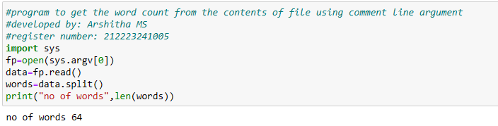
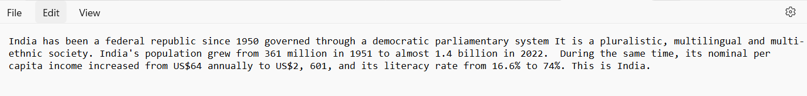

# command-line-arguments-to-count-word
## AIM:
To write a python program for getting the word count from the contents of a file using command line arguments.
## EQUIPEMENT'S REQUIRED: 
PC
Anaconda - Python 3.7
## ALGORITHM: 
### Step 1:
Import the sys module.
### Step 2: 
Pass the file name as the first argument.
### Step 3: 
Read the file using read() method.
### Step 4:  
Use the split() method to split the file content into words
### Step 5: 
Use len() to find the total words
### Step 6: 
Run the program to determine the number of words in the file
## PROGRAM:

### OUTPUT:

## RESULT:
Thus the program is written to find the word count from the contents of a file using command line arguments.
